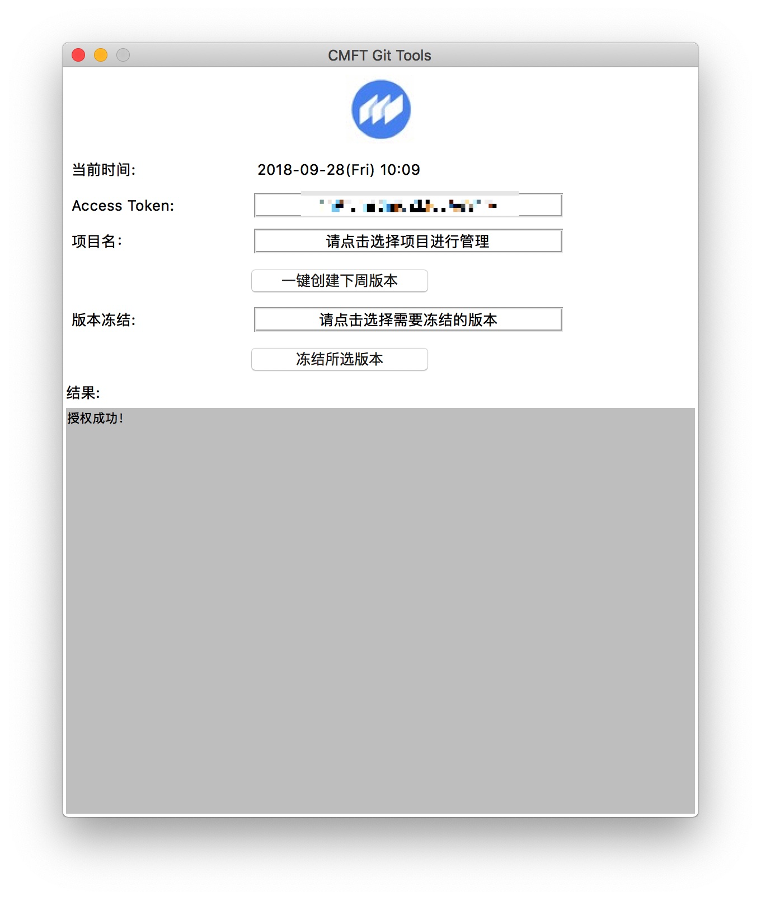
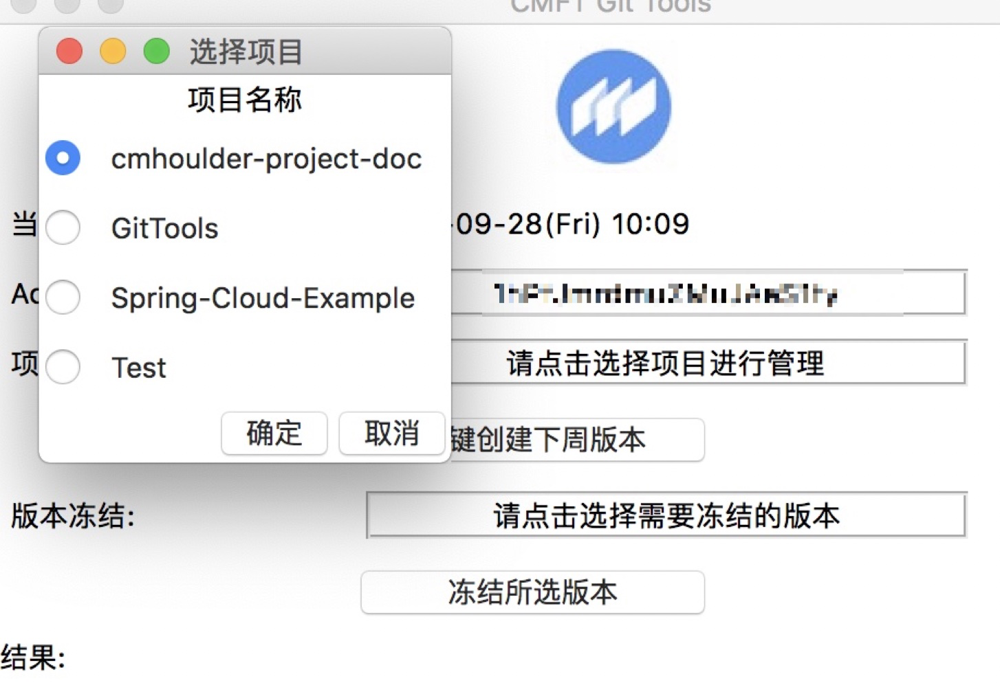
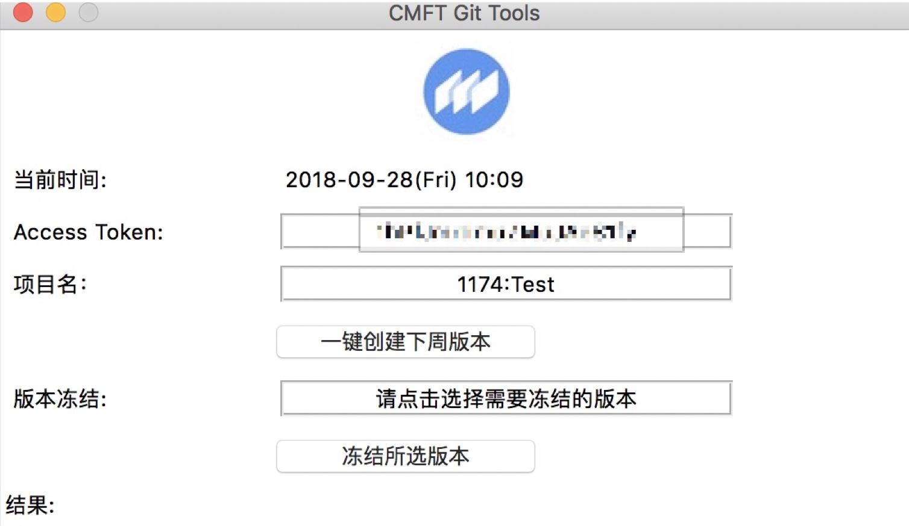
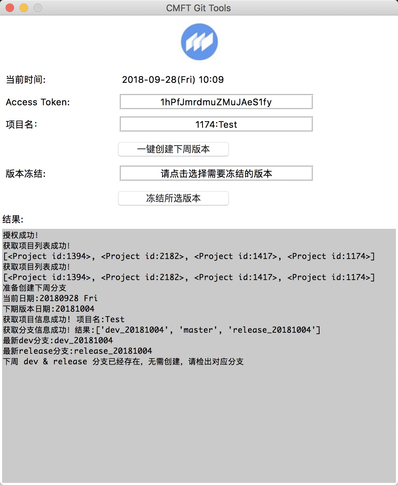
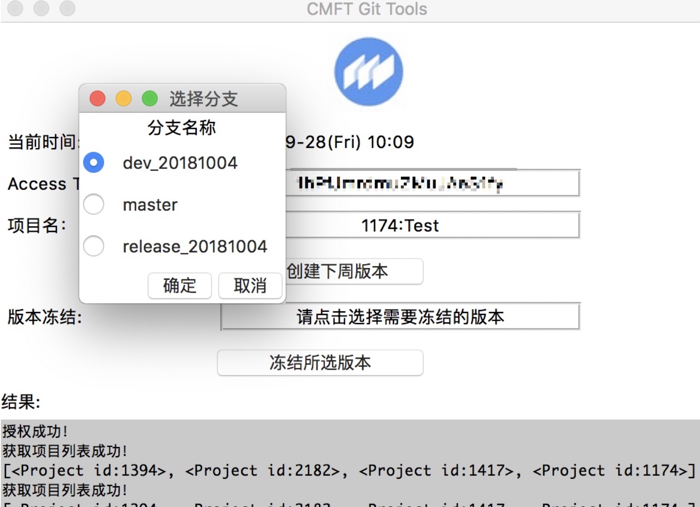
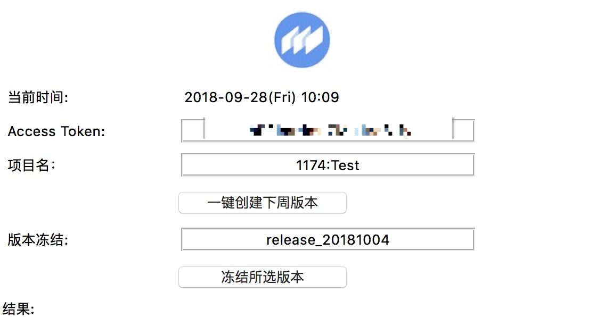
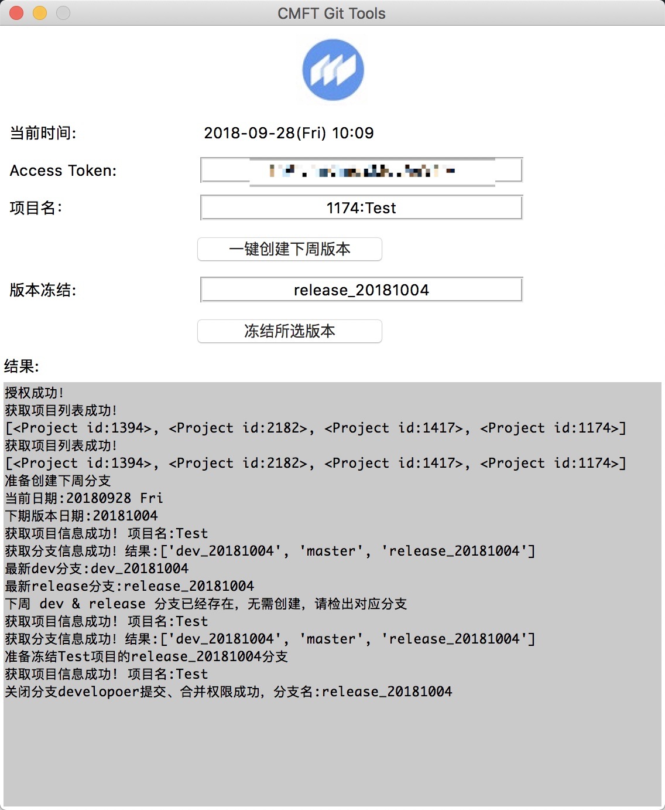

# GitTools
版本分支创建偷懒工具 for CMFT
(˶‾᷄ ⁻̫ ‾᷅˵)

## 安装相关依赖
python 3.x
```
pip install arrow
pip install --upgrade python-gitlab
```
## 功能
* 一键创建下周版本分支
* 查看分支功能
* 一键冻结版本

## 操作流程
1. 登录gitlab,点击个人头像选择setting

  
  
2. 选择Access Tokens

  

3. 设置Access Token

  

4. 将得到的token在窗口主界面进行设置



5. 选择项目



6. 点击确认选择项目



7. 点击一键创建下周分支



8. 点击选择需要冻结的分支



9. 点击确定所选分支



10. 点击冻结所选版本：



11. 完成

## 注意事项
此工具主要提供给项目管理员master使用，使用时请注意生成了正确的Access Token

## 启动
```
git clone http://git.dev.cmrh.com/chenn001/GitTools.git

cd GitTools

python main_window.py
```