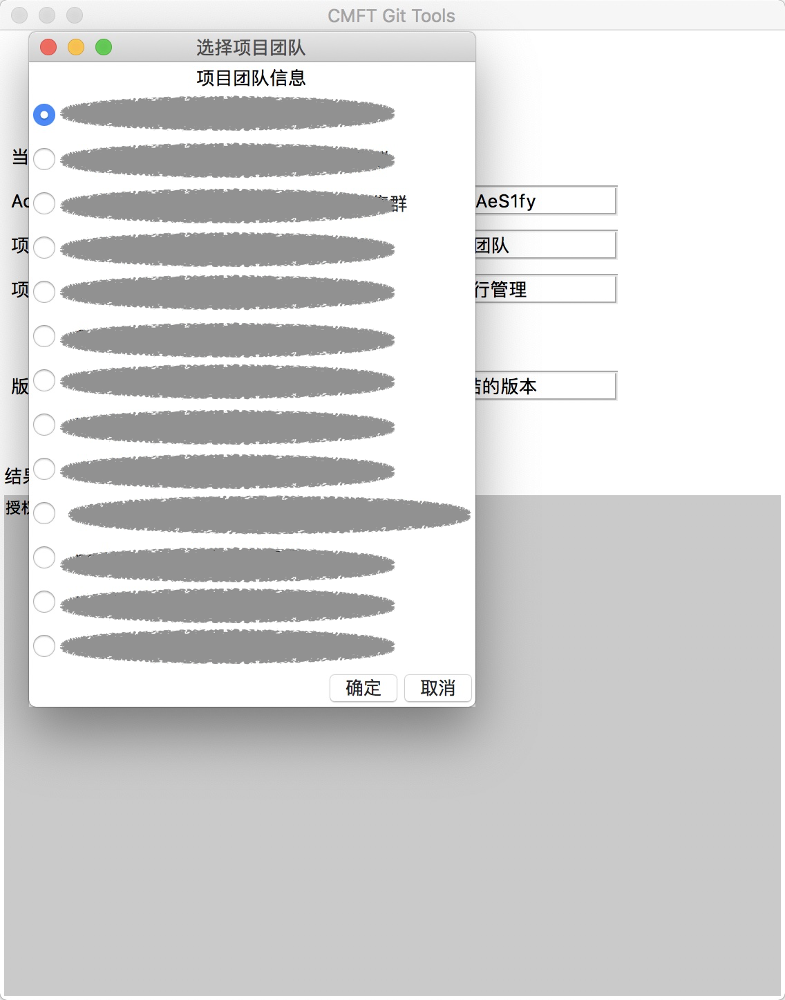
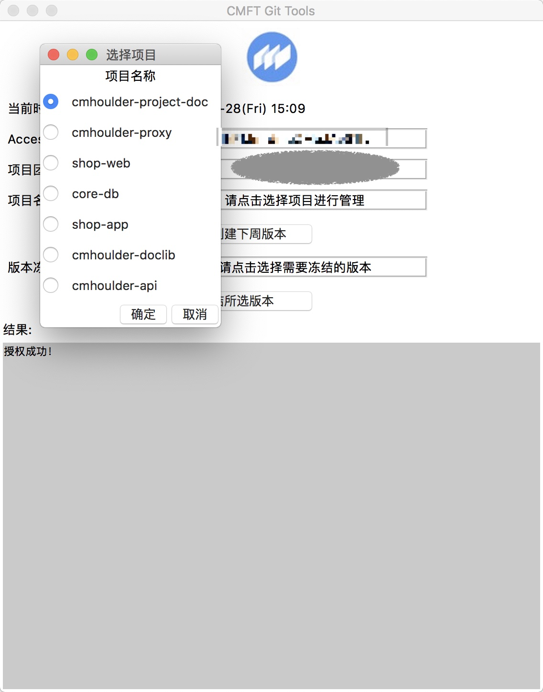
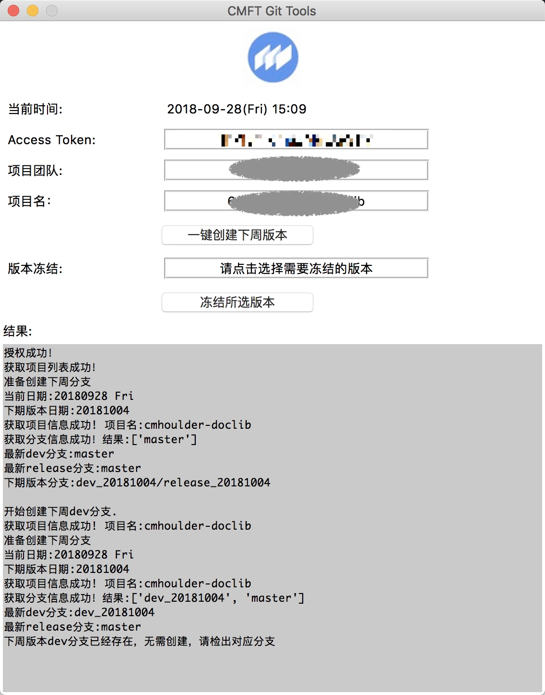

# GitTools
版本分支创建偷懒工具 for CMFT
(˶‾᷄ ⁻̫ ‾᷅˵)

## 安装相关依赖
python 3.x
```
pip install arrow
pip install --upgrade python-gitlab
```
## 功能
* 一键创建下周版本分支
* 查看分支功能
* 一键冻结版本

## 操作流程
1. 登录gitlab,点击个人头像选择setting

  

2. 选择Access Tokens

  

3. 设置Access Token

  

4. 将得到的token在窗口主界面进行设置


5. 选择项目团队



6. 选择项目



7. 点击确认选择项目


8. 点击一键创建下周分支




9. 点击冻结所选版本：


10. 完成

## 注意事项
此工具主要提供给项目管理员Master使用，使用时请注意生成了正确的Access Token，同时需要注意的是：能够查看到项目团队的项目信息的用户有可能因为不是Master所以会出现创建分支失败以及冻结分支失败的情况，请知悉。

## 启动
```
git clone <git repo url>>

cd GitTools

python main_window.py
```